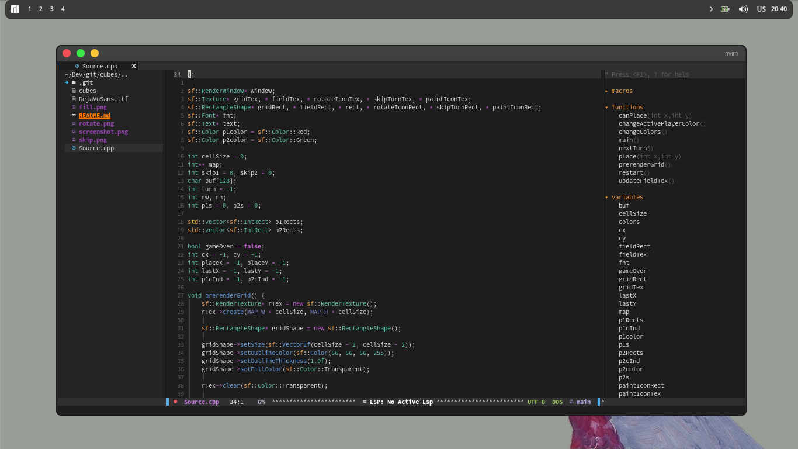
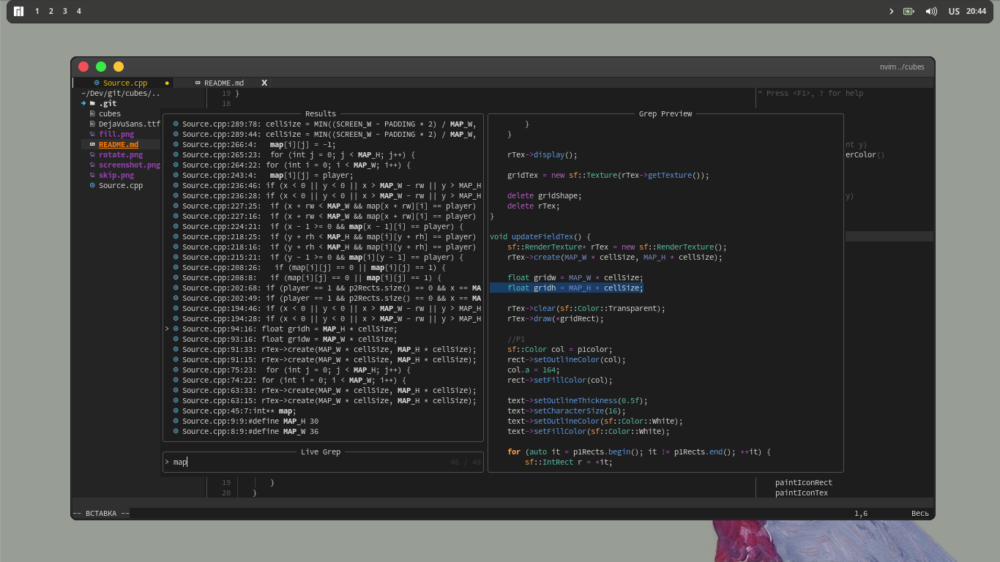

<h1 align="center">Nvim config with lua</h1>
<hr>
<div class="bages" align="center">
  <a href="https://github.com/Night3098/" target="_blank" rel="noreferrer">  </a>
   </a>
   </a>
</div>

<h2 align="center">Screenshots</h2>

<div class="screenshots">
  
  
</div>
<hr>
<h2 align="center">Installing</h2>

```
cd ~/.config
mv nvim old_nvim
git clone https://github.com/night3098/nvim
nvim
```

<h2>Please, install ctags</h2>

```
git clone https://github.com/universal-ctags/ctags.git
cd ctags
./autogen.sh
./configure --prefix=/where/you/want # defaults to /usr/local
make
make install # may require extra privileges depending on where to install
```
